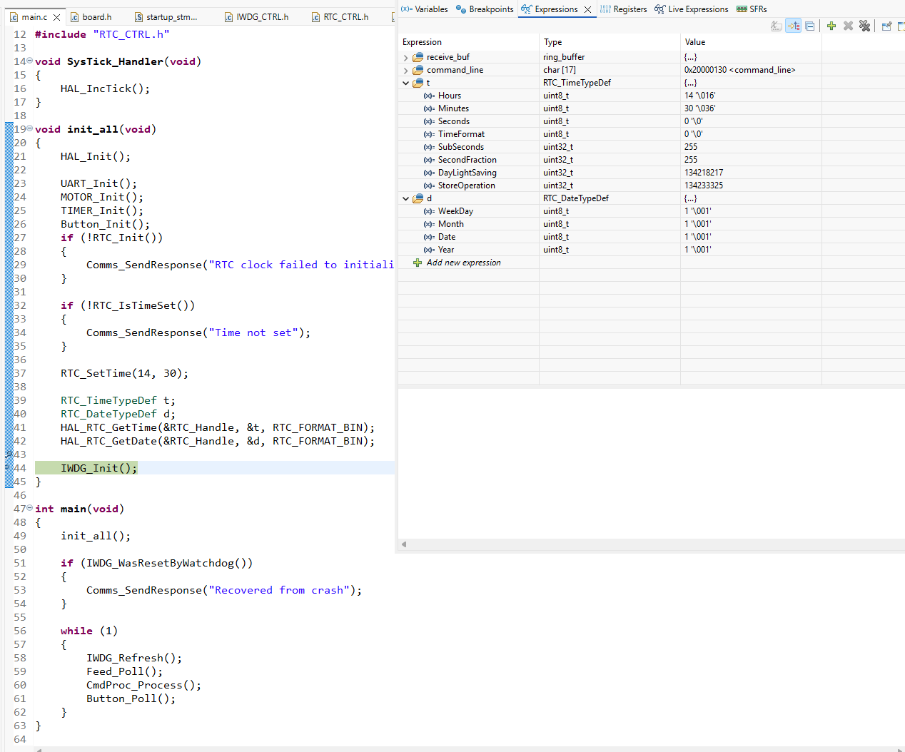

### 2026-08-02 -- Blink LD2 to verify the HAL GPIO path

First code on the board: a blocking blink of the on-board LED, to check that the project builds, flashes and runs.

**HAL does not enable the GPIO port clock.** Unlike the Nuvoton M2351 I use at work, this chip needs `__HAL_RCC_GPIOx_CLK_ENABLE()` before a pin can be configured. `HAL_GPIO_Init()` writes MODER, OTYPER, PUPDR and OSPEEDR directly and never touches RCC. Without the clock the writes go nowhere and the pin stays dead, with no error reported anywhere. ST lists it as a separate step in the "How to use this driver" block at the top of `stm32f4xx_hal_gpio.c`.

LD2 is on PA5, connected to Arduino signal D13 through solder bridge SB21 (UM1724 Section 7.6 and Section 7.11).

### 2026-08-07 -- UART_CTRL: ring buffer, clocks, NVIC priority, RXNE and ORE

Today I implemented and tested the UART_CTRL module.

#### Why a ring buffer

I used a ring buffer to store the raw bytes received on the USART2_RX pin. Unlike I2C, UART has no frame boundaries such as START/STOP conditions to mark one complete transaction, so UART_CTRL just puts raw bytes into `receive_buf`, and the comms module collects each byte into a command buffer until it sees a `\n`, which is what the protocol uses to end a command.

The problem is that UART is interrupt-driven while comms is polled in the main loop. There is guaranteed to be a mismatch between the rate at which the producer and the consumer handle data. That is where a ring buffer comes in: it gives the consumer more time to catch up without slowing the producer down.

#### Why `k+1` instead of a `size` variable

Either way, the ring buffer variables are shared between the consumer in the main loop and the producer in the ISR. With `front` and `rear`, the consumer only writes `front` and the producer only writes `rear`. This is fine, because each variable has exactly one writer.

A `size` variable breaks that. The consumer has to decrement it after taking a byte, and the producer has to increment it after writing one, so both sides write the same variable and a race condition appears. `volatile` alone does not fix it: it only tells the compiler not to keep the variable in a register and to re-read it from memory every time. It does nothing about the fact that `size--` and `size++` are read-modify-write sequences that can interleave.

For example, say `size` is 5:

1. the main loop reads 5, computes 4, but has not written it back yet
2. the ISR fires, reads 5, computes 6, writes 6
3. the main loop resumes and writes 4

The final value is 4. But since one byte was consumed and one was produced, they cancel each other out, so the correct value is 5 -- the ISR's increment is lost.

The `k+1` approach allocates `k+1` physical elements while only allowing `k` of them to hold data, which gives `(rear + 1) % (capacity + 1) == front` as the Full condition. Since `rear` always points to the next available index, if `rear + 1` wraps back to `front`, it means `rear` is sitting on that extra slot, so the buffer is full.

#### What happens if the consumer or producer reads an outdated value

This is the standard way to implement a ring buffer, and it is also the one that feels most natural. But it is worth writing down a property that falls out of it.

Removing the `size` variable removes the race condition that comes from one variable being written by both the ISR and the main loop. That race would otherwise need a critical section (disabling interrupts) or an atomic read-modify-write; designing it away is the cheaper fix.

Timing effects do not disappear entirely, though. Either side can still read a value the other side is about to change:

**Consumer reads a stale `rear`.** Say the buffer is empty, so `front == rear`.
The main loop reads both, sees them equal and takes nothing. An ISR then fires and stores a byte. The main loop picks it up on the next pass a few microseconds later. Nothing is lost.

**Producer reads a stale `front`.** Say the buffer is full. The main loop reads the byte at `front` but is interrupted before it updates `front`. The ISR sees the old value, concludes the buffer is still full, and drops the incoming byte. One byte is lost, but nothing already stored is overwritten.

In both cases the stale read makes that side *underestimate* what it can do: the consumer thinks there is less data than there is, the producer thinks there is less room than there is. The worst outcome is doing one less thing, never doing the wrong thing. That is a consequence of each index having exactly one writer, not something the code checks for.

The second case is also unlikely in practice. The buffer can hold more bytes than the longest supported command, and filling it would require the main loop to stall for far longer than it takes a byte to arrive at 115200 baud.

And if a byte were dropped, the layering absorbs it: Comms still assembles a line at the next `\n`, but the line is incomplete, so CmdProc matches it against no command and answers `"Invalid command"`. The stream resynchronises at the following `\n`. The firmware protects itself rather than relying on the host discipline.

#### Every peripheral needs its own clock

I remembered to enable the clock for GPIOA with `__HAL_RCC_GPIOA_CLK_ENABLE()`, but I forgot `__HAL_RCC_USART2_CLK_ENABLE()`. Without that line the whole USART2 peripheral is dead -- same lesson as the GPIO one from 08-02, just one level up: the pins were configured but the peripheral driving them was not clocked.

#### Set the ISR priority before enabling the IRQ

```c
HAL_NVIC_SetPriority(USART2_IRQn, 5, 0);
HAL_NVIC_EnableIRQ(USART2_IRQn);
```

and not the other way around, otherwise there is a window where the interrupt is live but still at its default priority.

The prototype is `void HAL_NVIC_SetPriority(IRQn_Type IRQn, uint32_t PreemptPriority, uint32_t SubPriority)`. PreemptPriority decides whether one IRQ can interrupt another; SubPriority only decides which one runs first when two are already pending at the same preempt level, and never causes a preemption. Note that `HAL_Init()` selects `NVIC_PRIORITYGROUP_4`, which gives all four implemented bits to preemption and none to subpriority, so in this project SubPriority is always 0 and has no effect.

UART has the tightest deadline of any peripheral interrupt here, so it gets the highest priority among them (SysTick sits at 0, above everything). I picked 5 to leave room in both directions: 0-4 for anything more urgent later, 6-15 for TIM, the button and the RTC alarm. Priorities are relative, not absolute.

#### RXNE, RXNEIE and ORE

To know exactly when a byte arrives, the ISR reads USART2's status and data registers directly. That is normal for the driver layer -- the rule in this project is that the application layer never touches registers, not that nothing does.

`RXNE` is set by hardware whenever the data register is loaded from the shift register. I had assumed that without `RXNEIE` set, `RXNE` could not be set. That is wrong: flags are set by hardware regardless of the interrupt enable bit. `RXNEIE` only decides whether setting the flag also raises a USART2 interrupt.

`ORE` (bit 3 in USART_SR) is the overrun error. It is set when `RXNE` is still 1 -- there is a byte in the data register that nobody has read -- and the next byte has finished arriving in the shift register with nowhere to go. RM0390 states that "the RDR register content will not be lost but the shift register will be overwritten", so the byte already in the data register stays valid; the one waiting in the shift register is the one lost, overwritten by whatever arrives next.

`ORE` is cleared by "a read to the USART_SR register followed by a read to the USART_DR register". My original implementation was:

```c
void USART2_IRQHandler(void){
	/* check RXNE: it is set when DR receives data */
	if (__HAL_UART_GET_FLAG(&USART2_Handle, UART_FLAG_RXNE)){
		uint8_t data = USART2->DR;
	}
	// ... other logic
}
```

`__HAL_UART_GET_FLAG()` does read SR, and this is fine in most cases, but it misses an edge case. Suppose `ORE` is set and something reads the data register without reading SR first -- for example the SFR (Special Function Register) view in the debugger. That read clears `RXNE` but leaves `ORE` set, because the clearing sequence needs both steps.

Now the ISR is stuck: `RXNE` is low, so the condition is false, so `DR` is never read, so `ORE` is never cleared -- and since `RXNEIE` raises an interrupt on either flag, the ISR is re-entered immediately, forever. The main loop never gets to run. This is an interrupt storm, not something the hardware can get out of on its own.

The fix is to read `DR` when either `RXNE` or `ORE` is high, since the action is the same for both: the former means there is data, the latter needs clearing. After that, if `RXNE` was the one set, the byte is valid and goes into the receive buffer; otherwise it is dropped.

### 2026-08-07 -- TIMER

#### Renaming TIM_CTRL to TIMER

I originally wanted TIM_CTRL to be one universal driver for the TIM peripheral on top of the HAL. That does not hold up, because "TIM" is not one thing. This chip has advanced-control timers (TIM1, TIM8), general-purpose timers (TIM2 to TIM5) and basic timers (TIM6, TIM7), and this project uses two of them for completely different jobs.

One generates the PWM that drives the motor STEP pin. That output goes out on a GPIO, so it needs a pin configured, and the waveform is really part of the A4988 interface -- so TIM2 belongs to `MOTOR_CTRL`.

The other just counts a requested amount of time and never leaves the chip. Basic timers have no output channels and no pins at all, which is exactly what that job needs. So this module keeps TIM6 and is named for what it provides rather than for the peripheral it happens to use.

#### The general shape of enabling an interrupt

Yesterday's UART work already had all the pieces; writing TIM6 made the pattern obvious.

There are three separate things involved:

- **The flag** -- set by hardware when the event happens. `RXNE` for UART goes high when a byte moves from the shift register into the data register. It is the hardware saying "a byte just arrived", and it is set no matter if anyone is listening.
- **The interrupt enable** -- `RXNEIE` for UART, `UIE` for TIM. This decides whether setting the flag also raises an interrupt request. Without it the flag still works; nobody knows about it.
- **The NVIC** -- the gate between the peripheral's interrupt request and the CPU. Without enabling it the request never reaches the core.

So enabling an interrupt on any peripheral is the same three steps:

```c
HAL_UART_Init(&USART2_Handle);
__HAL_UART_ENABLE_IT(&USART2_Handle, UART_IT_RXNE);   /* RXNEIE */
HAL_NVIC_SetPriority(USART2_IRQn, 5, 0);
HAL_NVIC_EnableIRQ(USART2_IRQn);
```

```c
HAL_TIM_Base_Init(&TIM6_Handle);
__HAL_TIM_ENABLE_IT(&TIM6_Handle, TIM_IT_UPDATE);     /* UIE */
HAL_NVIC_SetPriority(TIM6_DAC_IRQn, 6, 0);
HAL_NVIC_EnableIRQ(TIM6_DAC_IRQn);
```

The enable bit and the NVIC are set once at init. The flag is the part that has to be dealt with at run time, on every interrupt.

**How the flag gets cleared differs between peripherals.** For UART, reading the data register clears `RXNE` as a side effect, so handling the byte and clearing the flag are the same action. TIM has no such side effect: `UIF` must be cleared explicitly at the top of `TIM6_DAC_IRQHandler`. Forgetting it means the flag is still set when the handler returns, the interrupt fires again immediately, and the main loop never runs again -- the same failure mode as leaving `ORE` set.

##### Timer equation

    update frequency = f_tim / ((PSC + 1) * (ARR + 1))

`PSC + 1` because dividing a clock by zero makes no sense, so the register value N means "divide by N + 1" and 0 means "no division". `ARR + 1` because the counter is zero-based: it counts 0, 1, ... ARR, which is ARR + 1 ticks.

TIM6 has a 16-bit ARR, so it holds at most 65535. A higher ARR gives better resolution, but resolution only matters for PWM duty cycle, and 1% scale (from 1 to 100%) is usually enough. For a plain counter it buys nothing.

So the approach is to find a factor pair that divides evenly and reads well. I picked PSC = 15 and ARR = 999:

    16 MHz / (16 * 1000) = 1000 Hz  ->  1 ms per tick

1 ms is the unit this module exposes, so the application can ask for any duration it wants: a 5-second feed is just `TIMER_StartTimeout(5000)`.


### 2026-08-09 -- MOTOR_CTRL and the A4988

I implemented the MOTOR_CTRL module. The PWM that drives the motor's STEP input is generated on TIM2. Using the same equation as TIM6, I set the prescaler to 63 and ARR to 999:

    16,000,000 / ((63 + 1) * (999 + 1)) = 250 Hz

`OCPolarity` is HIGH, which means the output is high while `CNT < CCR`. CCR is 500, so the duty cycle is 50%.

For driving the A4988 the duty cycle does not actually matter, because the driver steps on the rising edge and ignores everything else. Any CCR between 1 and ARR produces the same motion; only CCR = 0 breaks it, since that removes the rising edge entirely. This is the opposite of PWM for LED brightness, where the duty cycle *is* the output and a larger ARR buys finer resolution.

I verified with a logic analyzer that the waveform is 250.56 Hz with a period of 3.991 ms. The 0.2% error comes from the HSI internal RC oscillator, which is specified at +/-1%.


#### Notes from the A4988 documentation

The Pololu page warns that "the STEP and DIR pins are not pulled to any particular voltage internally, so you should not leave either of these pins floating in your application." I enabled the internal pull-down on PA0 (STEP) and PA1 (DIR). The pull-down on STEP matters after `MOTOR_Stop()`, when the timer no longer drives the pin.

"Please note that the RST pin is floating; if you are not using the pin, you can connect it to the adjacent SLP pin on the PCB to bring it high and enable the board." RST and SLP are shorted with a jumper.

"Connecting or disconnecting a stepper motor while the driver is powered can destroy the driver." The reason is that motor coils are inductors and their current cannot change instantaneously: breaking the circuit while current is flowing produces a large `V = L * di/dt` spike that can punch through the driver's output stage. So: wire everything first, then power up; power down before touching any wire.

### 2026-08-10 -- Motor bring-up

Continuing from yesterday: the PWM was verified at 250 Hz, so today was about actually driving the motor.

#### The multimeter only measures resistance when the circuit is off

I keep forgetting this. Before connecting the 12 V supply I wanted to confirm that VMOT was not shorted to VDD, and the continuity buzzer went off, which got me worried for a moment. But continuity and resistance modes work by pushing a small current through the circuit and measuring the drop -- with the MCU powered, that measurement is meaningless. With everything unpowered the same two points read over 10 kΩ, which is the internal path through the chip and perfectly normal.

This rule goes at the top of the wiring checklist: **unplug everything before any resistance or continuity measurement.**

#### Setting V_ref

The A4988 does not put the motor supply straight across the coils. The motor is rated 2 A per coil at a few volts, so 12 V applied directly would push several amps and destroy both the motor and the driver. Instead the driver chops: it watches the current through a sense resistor and switches off once the limit is reached. `V_ref` is the knob that sets that limit.

    I_max = V_ref / (8 * R_cs)

`R_cs` on my board is marked **R100**, i.e. 0.1 Ω. Pololu states that all units they have made since 2017 use 0.068 Ω sense resistors (0.050 Ω before that), so neither value matches -- mine is a HiLetgo StepStick clone, and the marking on the board is what counts.


The motor is rated 2 A per coil (STEPPERONLINE NEMA 17, 59 Ncm). The A4988 can reach 2 A, but only with a heat sink *and* forced air; I only have the heat sink, so I set the limit conservatively:

    V_ref = 8 * 1.0 A * 0.1 Ω = 0.8 V

It measured 0.41 V out of the box, which works out to 0.36 A per coil, so this is double what the default build was running at.

Note that running below the motor's rating costs torque: if the auger meets more resistance than the motor can overcome, it skips steps and the firmware has no way to notice. The definition of one serving -- 5 seconds at 250 Hz in full-step mode, so 6.25 revolutions -- assumes no steps are lost.

#### Rewiring the supplies

Previously the 12 V supply went to a rail on the breadboard and from there to VMOT and GND, while VDD went straight from the MCU's 3.3 V pin. This time nothing goes through the rails: the 12 V leads plug directly into VMOT and the adjacent GND, and 3.3 V plugs directly into VDD. With no 12 V node anywhere on the rails, shorting it to the logic rail is not possible in this case.

A continuity test (unpowered) confirmed that the two GND pins on the A4988 are connected internally. So there were two equivalent ways to establish a common ground: bring both the MCU ground and the 12 V negative to the same `-` rail and jumper across, or connect the 12 V negative to the GND next to VMOT and the MCU ground to the GND next to VDD. I went with the latter. Either way the two domains share a reference, which they must -- the A4988 has to interpret the MCU's 3.3 V STEP and DIR levels against the same 0 V.

The rule of thumb is: **Grounds connected, supplies never connected**

Per the Pololu warning about voltage spikes on carriers with low-ESR ceramic capacitors, there is a 100 µF capacitor across VMOT and GND, placed close to the board rather than out at the supply end. With the capacitor at the far end, the lead wires are still part of the loop and the capacitor does not do its job.

#### On the board I burned

I still cannot reconstruct exactly what happened. What I remember is that the 12 V went in before the MCU was powered, but the wiring was disturbed afterwards, so the state I found might not have been the state it failed in. It may have been the order, or a 12 V lead touching the logic side. What argues against the order alone being the cause is that the same setup had worked repeatedly before.

The general rule: power the MCU first, then the 12 V; on shutdown remove the 12 V first. But it is only a habit, not a safeguard. An unpowered chip is not a safe chip -- the protection diodes on the pins exist to shunt brief static discharges, not to survive sustained overvoltage, and with VDD at 0 V there is no supply to absorb the injected current. The actual safeguard is that 12 V now has no path to the logic side at all.


### 2026-08-15

#### `strcmp` returns 0 on a match

In `CmdProc_Process` I compare the assembled command line against each supported command:

```c
int strcmp(const char *str1, const char *str2);
```

The counter-intuitive part is that it returns **0** when the two strings are identical, not 1. The name is short for "compare", and the return value is really a difference: negative, zero or positive depending on ordering. So `if (strcmp(a, b))` reads as "if they differ".

I wrote `if (strcmp(command, "FEED"))` at first, which inverts every branch. Worse, it still compiles and still looks correct.

#### `static` does not apply to a type definition

I tried to write `static typedef enum {...}` in `Feed.c`, thinking the enum should be hidden from other files.

That does not work, and it is not needed. `static` at file scope gives *internal linkage* to a variable definition or a function -- it hides a symbol from the linker. A type definition does not create a symbol at all; it only tells the compiler how to lay out memory for variables declared with that type later. There is nothing to hide.

Scope already does the job. The two enums in this module are split on purpose:

- `Feed_Source` lives in `Feed.h`, because callers need it: `Feed_Request(FEED_CMD)`.
- `Feed_State` lives in `Feed.c`, because nothing outside needs to know how the module tracks itself. Being defined in the `.c` file is enough -- no other translation unit can see it.

The variable holding the state *is* a definition, so that one does get `static`:

```c
static Feed_State curr_state = FEED_STATE_IDLE;
```

#### Why Feed needs two functions

Per the arbitration diagram there are three states. When idle, a request from any source is accepted; while feeding, only a scheduled request is accepted and it moves the state to Pending.

`Feed_Request()` handles one event: a request arrives, it is accepted or dropped, and on acceptance the motor and the timer start. But that is a one-way path -- idle to feeding to pending. Nothing in that function can bring the state back, because the thing that ends a feed is not a request; it is the timer running out, several seconds later.

So the module needs a second entry point. `Feed_Poll()` is called every pass of the main loop and asks `TIMER_InProg()` whether the current feed is still running. When it is not, that pass is the one where the feed just completed: stop the motor, then either start the pending feed or return to idle.

This split is also why stopping the motor lives in the main loop rather than in the timer ISR.

There are two different ways this firmware can fail, and they behave differently.

**The main loop hangs, but the CPU is fine.** Say it gets stuck in a `while(1)` -- which is exactly what the `CRASH` command does. The CPU keeps fetching and executing, and interrupts keep firing: the timer counts down, NVIC raises the request, the CPU jumps into the ISR, runs it, and returns straight back into the loop it is stuck in. So if the ISR stopped the motor, the feed would end cleanly on schedule and everything would look normal from the outside, while the main loop had in fact been dead for seconds.

Requiring the main loop to stop the motor makes "feed complete" mean something stronger: the code the watchdog supervises is still alive.

**Something worse happens and the CPU ends up in the HardFault handler.** That exception has priority -1, above every peripheral interrupt, and the default handler is itself a `while(1)`. The CPU stays inside a higher-priority exception context, so the timer ISR never gets serviced at all -- the motor would keep running.

This is where the watchdog comes in. It does not care which of the two happened, or what caused it. It only cares that the main loop stopped refreshing it, and resets the system either way.

Which is also why refreshing the watchdog has to be the main loop's job, and only the main loop's: the whole point is that the refresh is evidence the supervised code is still running.

### 2026-08-18 -- First end-to-end run

I wired the two application polls into the main loop:

    while (1) {
        Feed_Poll();
        CmdProc_Process();
    }

and sent `FEED\n` from the host (VS Code's Serial Monitor extension) to check the whole chain: UART interrupt, ring buffer, line assembly, command match, arbitration, response. Below is the log:
```text
---- Opened the serial port COM4 ----
---- Sent utf8 encoded message: "FEED\n" ----
Invalid command
---- Sent utf8 encoded message: "FEED\n" ----
Feeding started
---- Sent utf8 encoded message: "FEEDFEED\n" ----
Invalid command
---- Sent utf8 encoded message: "FEED\n" ----
Feeding started
---- Sent utf8 encoded message: "FEED\n" ----
Busy feeding
```

#### Getting the terminator sent at all

The Serial Monitor extension does not let me type `\n` directly -- typing a backslash sends a literal backslash. Without a terminator, Comms never completes a line, so nothing downstream ever runs. The fix was the **Line ending** dropdown in the extension, set to LF.

#### Why bytes went missing under a breakpoint

Before I found that, I put a breakpoint on the `default` case in `Comms_PollCommand()` to check whether bytes were arriving at all:

    default:
        if (command_line_idx < COMMAND_LINE_MAX){
            command_line[command_line_idx] = (char)byte;
            command_line_idx++;
        } else {
            discarding = true;
        }
        break;

It did hit, which confirmed `UART_CTRL_ReadByte()` was delivering bytes. But the behaviour was consistent across two runs: after sending `FEED`, the `F` and the first `E` made it into `command_line`, and everything after that was **lost**.

The cause is the breakpoint itself. Halting the CPU stops the ISR from running, but it does not stop the USART peripheral -- that keeps receiving in hardware regardless of what the CPU is doing.

`RXNE` is set when a complete byte moves from the shift register into the data register. So: `F` lands in DR, the CPU reads it and then halts. `E` lands in DR and sets `RXNE`, but with the CPU halted nobody reads it, so DR stays occupied. When the next byte finishes arriving in the shift register there is nowhere to put it, and `ORE` is set (RM0390 p.784). The byte already in DR is preserved; the one waiting in the shift register is the one lost, overwritten by whatever arrives next.

So `Step Over (F6)` let me read the `E` sitting in DR, but the remaining `E` and `D` were gone.

Worth noting this was self-inflicted -- I was debugging a problem that only existed because I had not sent a terminator. But the takeaway stands: **do not put breakpoints on the receive path.** Halting the CPU for even a few hundred microseconds is enough to overrun the UART at 115200 baud, where a byte arrives every 87 us. It also confirms the ORE branch in `USART2_IRQHandler` is doing its job -- without it the flag would have stayed set and RXNE would never have fired again.

#### Reading the log

The first `Invalid command` was leftover state: the breakpoint sessions had left bytes in `command_line` with a non-zero index, and I had not reset the chip. The next `FEED\n` was appended to that garbage rather than starting a fresh line.

`FEEDFEED\n` correctly returned `Invalid command`. That is Protocol section 4.5 working as intended: every line is interpreted as one command, so an eight-character line simply matches nothing. There is no such thing as a partially valid line.

The last pair is the one worth having: two `FEED\n` sent a moment apart. The first started a feed, and the second arrived inside the 5-second window and was dropped with `Busy feeding`. That is the centre cell of the arbitration table -- a request from UART or the button is dropped while the motor is busy, and only a scheduled feed is deferred. It also exercises the ring buffer, since the second command's bytes arrive while the first response is still being transmitted.

### 2026-08-19 -- IWDG and the crash commands

With IWDG_CTRL module implemented, I added `IWDG_Refresh()` into the main loop, as the first thing each iteration, per the control flow diagram.

#### Timing

The IWDG runs off the LSI. With the prescaler set to 32, the counter clock is 32 kHz / 32 = 1 kHz, so one count is 1 ms. RLR is set to 999, which gives a timeout of about 1 second.

That number is an upper bound on how long the CPU may go without refreshing, not how often it actually refreshes. In practice the loop comes around far faster than that; the timeout only has to be longer than the slowest legitimate pass.

One thing worth writing down: the LSI is an internal RC oscillator, and the datasheet specifies it at 17-47 kHz (datasheet p.106), not exactly 32. So "1 second" is really somewhere between roughly 0.7 s and 1.9 s. That is fine here, because nothing in the firmware blocks for more than a few milliseconds and the margin is forgiving, but it means the timeout should never be treated as a precise value.

#### Reporting the reset cause

`RCC_CSR` records why the last reset happened -- `PINRSTF` for the reset button, `SFTRSTF` for a software reset, `IWDGRSTF` for the watchdog, and so on. These flags are not cleared by a reset, which is exactly what makes them useful; they have to be cleared explicitly by writing RMVF.

I added `IWDG_WasResetByWatchdog()`, which reads `IWDGRSTF` and returns a bool. For now that is all I need, but a switch/case over the other flags could report the exact cause later.

It is called once in `main`, after init and before the loop:

```c
if (IWDG_WasResetByWatchdog())
{
    Comms_SendResponse("Recovered from crash");
}
```

This felt counter-intuitive at first -- my instinct was that the main loop should poll it, since anything before `while(1)` only runs once and by then the crash has already happened. But that is backwards. The crash does not return to this current session; the watchdog *resets the chip*, so `main` starts over from the top. The flag survives the reset, the check runs on the way back up, and the message goes out. Startup is the only place this check makes sense.

#### CRASH

```c
else if (strcmp(command, "CRASH") == 0){
    /* hangs the CPU deliberately */
    while (1){}
}
```

The loop stops the main loop from refreshing the watchdog. About a second later the chip resets, and the next boot reports it.

#### CRASHFEED

```c
else if (strcmp(command, "CRASHFEED") == 0){
    Feed_Request(FEED_CMD);
    while (1){}
}
```

This one starts a feed and *then* hangs, so the crash happens while the motor is running. It tests something `CRASH` cannot: that a fault during motor motion **still ends with the motor stopped**.

Nothing in my code stops it. `Feed_Poll()` normally does that from the main loop once the timer expires, but the main loop is dead. What stops the motor is the reset itself: TIM2's `CEN` is cleared, the output compare enable goes with it, and PA0 reverts to a floating input, so the STEP waveform disappears. All of that is hardware, at a point where the firmware is no longer executing anything.

The observable result is that the motor runs for roughly a second and stops, instead of the full five. The watchdog timeout is shorter than a feed, so the reset arrives first.

```text
---- Sent utf8 encoded message: "FEED\n" ----
Feeding started
---- Sent utf8 encoded message: "CRASH\n" ----
Recovered from crash
---- Sent utf8 encoded message: "CRASHFEED\n" ----
Recovered from crash
```

#### Noise and heat at idle, and the EN pin

Even following the power-up order -- MCU first, then the 12 V -- the motor hummed continuously while idle and the A4988 felt warm.

The hum is normal for a stepper: both coils stay energised at standstill to hold position, and the driver maintains that current by chopping, which the coils turn into audible noise. But holding current is dissipated the whole time, and a cat feeder is idle for well over 99% of its life.

I had been ignoring the `EN` pin on the A4988, which is active low: driving it high disables the coil drivers entirely. I assigned it to PA8 and added it to MOTOR_CTRL module. In `MOTOR_Start()` I pull EN low *before* starting the PWM, so no STEP edge lands on a disabled driver. In `MOTOR_Stop()` the order is reversed -- stop the PWM first, then disable -- though that direction matters less, since the motion is ending either way.

Known limitation: between power-on and `MOTOR_Init()`, PA8 is a floating input and the A4988's internal pull-down holds EN low, so the coils are briefly energised. An external pull-up would close that window, but it would mean running a 3.3 V rail on the breadboard, which conflicts with the wiring rule that no logic voltage goes on a rail at all. A few milliseconds of holding current is harmless, so I left it.

#### On the heat

With a finger on the A4988's heat sink it felt slightly warm, but I could hold it there almost forever. That is not a measurement, and I do not think my subjective impression is worth much in this case. Adding `EN` should remove the question entirely, since the coils are now only energised during the five seconds of an actual feed.

The open question is the sense resistor. Both the physical board and the Amazon listing photo show `R100`, i.e. 0.1 Ω, and I set `V_ref` on that basis. But Pololu's own documentation states 0.068 Ω for their carriers, so mine being a clone, I cannot be completely sure which value applies. If the real value is 0.05 Ω, the actual current is double what I calculated.

I wanted to measure the coil current directly, but my multimeter came with probe tips rather than alligator clips, and the measurement requires breaking one motor lead to put the meter in series. Pololu is explicit that "connecting or disconnecting a stepper motor while the driver is powered can destroy the driver", and having the meter fall off mid-measurement is exactly that scenario. Left for another day with proper clips: the coil current only flows during a feed now, but I would still rather know the number than assume it.

### 2026-08-20 -- Button

Added the `Button` module. The behaviour copies the commercial feeder I own: the user can hold the button as long as they like, but the request is raised when they let go, not when they press. One press and release is exactly one feed request.

PC13 is active low -- the pin reads 0 while the button is held and 1 once it is released -- so the event to detect is the transition from pressed back to idle.

#### Polled, not interrupt-driven

The button does not use EXTI. Main calls `Button_Poll()` once per pass, in the order given by the control flow diagram.

This keeps the module coherent with the ones already there. CmdProc raises a feed request when command matches `FEED`; Button raises one when it sees a release. Main walks through each source in order but never decides anything itself -- each module applies its own logic and calls `Feed_Request()` on its own behalf.

Polling is also enough on its own terms: a human press lasts at least milliseconds while the loop comes around in microseconds. An interrupt would buy nothing here and would cost an extra interrupt source.

```c
if (was_pressed && !pressed){
    Feed_Request(FEED_BUTTON);
}
```

#### No software debounce

The Nucleo's B1 button is filtered in hardware by an RC network on the board, so debouncing here would be redundant. If this ever moves to a board without that filter, the fix is confined to this module -- nothing else in the system knows or cares how a button press is detected. That containment is the practical payoff of using the layered architecture.

#### The module was written but never initialised

The first time I tested it, nothing happened at all. The code was fine; `Button_Init()` was simply missing from `init_all()`, so GPIOC's clock was never enabled and PC13 was left floating.

Worth noting because of how it presents: a module that is never initialised looks exactly like a module that is broken. Nothing in the build catches it, and reading `Button.c` over and over would never have found it. The check is to confirm the module is actually wired into startup before questioning its logic.

#### Verification

Holding the button for various lengths of time and releasing produced exactly one feed each, starting on release.

I also pressed and released the button while a feed started by the `FEED` command was already running. The motor still ran for about five seconds, not longer -- the button request was dropped, as the arbitration table specifies. Nothing is reported in that case, since the button has no return path to tell anyone.

### 2026-08-22 -- RTC_CTRL

The RTC is the most involved peripheral I have used in this project so far.

#### Two things have to happen before the RTC is even reachable

Its initialization takes more steps than any other peripheral here, because it lives in the backup domain -- a region of the chip that survives a system reset and is write-protected by default, so that stray code cannot corrupt the clock.

Unlocking it means setting the `DBP` bit (Disable backup domain write protection) in the PWR power control register, `PWR_CR`. That bit lives in the PWR peripheral, so the PWR clock has to be enabled first. PWR itself is not protected -- it is the gate that unprotects the backup domain.

The second thing is the clock source. Other peripherals hang off a bus clock, but the RTC has to keep counting while the CPU is asleep, so it needs its own low-power oscillator. This board uses the LSE, an external crystal running at exactly 32.768 kHz.

That is a different trade-off from the IWDG, which runs off the LSI. The LSI is an internal RC oscillator specified at 17-47 kHz, so "one second" is really somewhere between 0.7 and 1.9 seconds. That is fine for a watchdog: the main loop comes around in milliseconds, so the margin is enormous either way. It is not fine for a calendar. At worst the LSI is off by roughly 45%, which over a single day is around eleven hours of drift. Not every Nucleo board has an LSE crystal fitted, but the MB1136 C-04 does.

#### Why RTC_Init returns a bool

Every other Init in this project ignores the `HAL_StatusTypeDef` return value, because those functions only enable a clock and write configuration registers -- they hardly fail.

The RTC is different: `HAL_RCC_OscConfig()` waits on a physical crystal to start oscillating, and that genuinely can time out. So `RTC_Init()` returns `bool` and gives up early if the LSE does not come up.

Without that check, `HAL_RTC_Init()` would still run and everything would look fine, but the RTC would have no clock and the calendar would never advance. The failure would be silent: I would only find out by noticing a scheduled feed never happened, and then I would not know whether the problem was in CmdProc setting the time wrong or in the RTC not running at all.
```c
if (!RTC_Init())
{
    Comms_SendResponse("RTC clock failed to initialize");
}
```
Reporting it over UART is enough for now. A real product would need something better, since the host is not always connected.

#### `RTC_IsTimeSet` and the year field

`bool RTC_IsTimeSet(void)` reads the `INITS` flag in `RTC_ISR`. What is worth knowing is how the hardware decides: RM0390 says the flag is set when the calendar **year field is different from 0** -- 0 being the backup domain reset value.

So even though this project has no use for the year -- it feeds the cat at fixed times of day and never cares what day it is -- the year still has to be set to something non-zero. Leaving it at 0 would make `RTC_IsTimeSet()` return false forever, and the whole "has the clock been set" branch in the protocol would never work.

#### `RTC_SetTime` and what actually had garbage in it

`bool RTC_SetTime(uint8_t hour, uint8_t minute)` guards the input first (`hour > 23` or `minute > 59` is rejected), then fills an `RTC_DateTypeDef` and an `RTC_TimeTypeDef` and hands them to `HAL_RTC_SetDate()` and `HAL_RTC_SetTime()`. Both return values are checked; either one failing fails the whole call.
```c
RTC_DateTypeDef date = {
    /* WeekDay, Month and Date are irrelevant here; any valid value will do */
    .WeekDay = RTC_WEEKDAY_MONDAY,
    .Month   = RTC_MONTH_JANUARY,
    .Date    = 1,
    .Year    = RTC_DEFAULT_YEAR   /* must be non-zero: INITS keys off the year field */
};

// ......

RTC_TimeTypeDef time = {
    .Hours   = hour,
    .Minutes = minute,
    .Seconds = 0,
};
```

When I later inspected the structs in the debugger, some fields held garbage, and I initially blamed the local structs in `RTC_SetTime()`. That was wrong from two perspectives.

First, **a partially written initializer list is not the same as no initializer at all**. If an object has any initializer, C zero-initializes every member that is not listed -- automatic storage duration included. So `date` and `time` above have no garbage; `.SubSeconds`, `.DayLightSaving` and the rest are all 0.

The garbage was in the read-back structs I put in `init_all()` for testing, which had no initializer at all:
```c
    RTC_TimeTypeDef t;
    RTC_DateTypeDef d;
```
Those really are whatever was left on the stack. And `DayLightSaving` and `StoreOperation` stayed garbage even after the call, because `HAL_RTC_GetTime()` never writes them -- reading the HAL source, it only fills SubSeconds, SecondFraction, Hours, Minutes, Seconds and TimeFormat. A HAL "Get" function does not necessarily populate the whole struct.

I did briefly consider adding `static` to the locals in `RTC_SetTime()` to get the zeroing. That does not work, for a reason I had already written down in the note on `static` from a week ago: **a static-storage-duration object needs a compile-time constant initializer**, and `.Hours = hour` is a function parameter. It would not compile. And if it somehow did, `static` would mean the initializer runs only once, so every call after the first would silently reuse the original time.

#### Testing
```c
if (!RTC_IsTimeSet())
{
    Comms_SendResponse("Time not set");
}

RTC_SetTime(14, 30);
```

The check comes before the set, so on a genuinely fresh backup domain the host should see the message exactly once. It did:

```text
---- Opened the serial port COM4 ----
Time not set
```

Then I used "reset the chip and restart debug session" in CubeIDE, and the reset button on the board. Neither produced the message again, which is the point: the calendar survives a system reset. That is the foundation the whole scheduling design rests on.

Worth being precise about what this does *not* prove. A reset is not a power cycle. VBAT is tied to VDD on this board, so pulling the USB cable does drop the backup domain, and "Time not set" should come back. Those are the two branches the protocol distinguishes, and I have only verified one of them so far.

#### Reading the calendar back
```c
RTC_TimeTypeDef t;
RTC_DateTypeDef d;
HAL_RTC_GetTime(&RTC_Handle, &t, RTC_FORMAT_BIN);
HAL_RTC_GetDate(&RTC_Handle, &d, RTC_FORMAT_BIN);
```

The HAL documents that the second call is not optional:

```text
You must call HAL_RTC_GetDate() after HAL_RTC_GetTime() to unlock the values in the higher-order calendar shadow registers... 
Reading RTC current time locks the values in calendar shadow registers until current date is read.
```

So even with no interest in the date, it has to be read, or the shadow registers stay latched and the time stops appearing to change.



#### Two things I ran into while testing

**Locals do not survive the function.** The four lines above went into `init_all()`, which runs once. I could only see `t` and `d` by putting a breakpoint inside `init_all()` after those lines and before it returns. Putting a breakpoint anywhere in the `while(1)` loop gave "No symbol d in current context", because its stack frame is destroyed once retured from this function.

**The watchdog was starting too early.** The first time I put a breakpoint on the `HAL_RTC_GetDate()` line, CubeIDE reported `Breakpoint installation failed: Connection is shut down`, which I had never seen before.

I do have "Suspend watchdog counters while halted" enabled in the debug configuration, so the immediate cause is still not certain, but looking at `init_all()` I found a real ordering problem regardless. I had called `IWDG_Init()` first, mirroring the control flow diagram -- but that diagram describes the order of the *main loop*, where refreshing the watchdog goes first. **Initialization is not the same as main loop.**

`HAL_IWDG_Init()` starts the watchdog immediately, and nothing refreshes it until the main loop begins. **Everything between those two points has to finish within the timeout**, and `RTC_Init()` sits right in the middle of it, blocking while it waits for the crystal.

**So the watchdog should be initialized *last*: it guards the system, and the system should be ready before it is guarded.** I moved `IWDG_Init()` to the last line of `init_all()`.